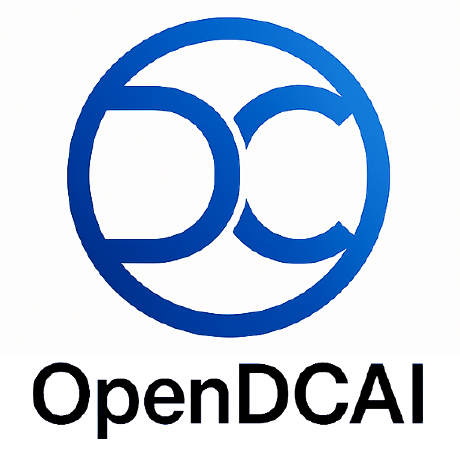
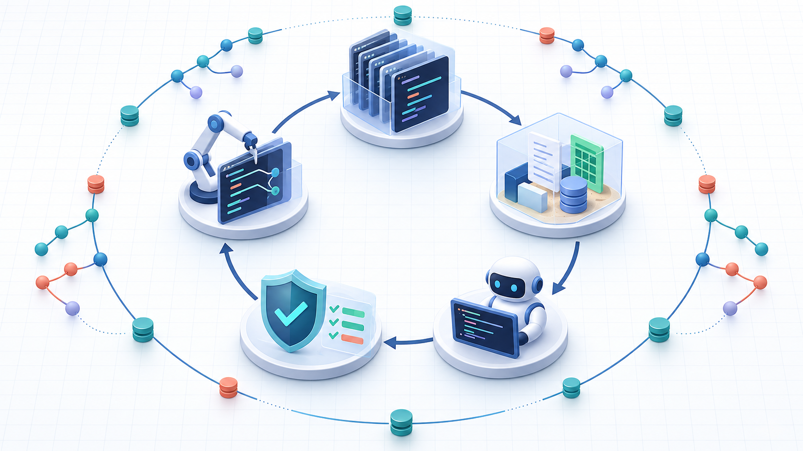

<h1 align="center">HarnessEvoGym</h1>

  <strong>A trusted, reproducible gym for evolving agent harnesses—not just their prompts.</strong>

  HarnessEvoGym turns harness self-improvement into an experiment you can inspect: 
  choose <strong>what evolves</strong>, <strong>where it works</strong>, and <strong>how evolution searches</strong> as independent components, 
  while a frozen Controller owns permissions, evaluation, promotion, rollback, and lineage.

  A collaboration between  <strong>Peking University DCAI / OpenDCAI</strong> and  <strong>AutoCosm.AI</strong>

  <a href="README.zh.md">中文</a> ·
  <a href="#quick-start">Quick start</a> ·
  <a href="docs/architecture.md">Architecture</a> ·
  <a href="CONTRIBUTING.md">Contributor guide</a> ·
  <a href="README.dev.zh.md">Development log</a>

  
  
  
  

---

**Core capabilities**

| What you control | How it works |
| --- | --- |
| **Target** | Choose which harness evolves: MSA Minimal Cowork, MSA Minimal Reasoning, or DeepSeek Harness path |
| **Environment** | Validate on real tasks: OmegaUse-OfficeVal or HLE Text-only Math |
| **Evolution** | Five population modes (single, independent, mutualism, competition, combined) + pluggable search strategies |
| **Trust** | Controller, evaluator, hidden split, credentials, and promotion policy stay outside the Candidate write set |

~~~
Target × Environment × EvolutionAlgorithm × EvolutionRecipe
~~~

## Why this exists

Letting a coding agent edit itself is easy. Knowing whether the new version is
actually better is the hard part. A useful RSI loop must stop the evolving agent
from changing its judge, leaking hidden tasks, writing outside the selected
module, or promoting a noisy tie.

HarnessEvoGym makes those boundaries executable:

| Concern                | HarnessEvoGym answer                                                   |
| ---------------------- | ---------------------------------------------------------------------- |
| **What may change?**   | Target-owned Mutation Regions, translated into a one-round hard lease  |
| **Who may change it?** | A pluggable Updater such as Codex CLI or DeepSeek Harness               |
| **What proves value?** | Environment-owned tasks, verifier, metrics, and strict promotion gates |
| **How is it searched?**| Population topology + an independent module SearchStrategy             |
| **What stays trusted?**| Controller, Gateway, evaluator, split, credentials, and final set      |

## The model

One Candidate generation follows this loop:

  

  <em>Champion → Region selection → MutationLease → Updater edits Candidate → Diff validation → Solver runs tasks → Verifier scores → promotion gates decide</em>

| Layer                | Owns                                                                    | Does not own                         |
| -------------------- | ----------------------------------------------------------------------- | ------------------------------------ |
| **Target**           | Harness source, H0 seed, runtime, validator, and mutable Region catalog | Tasks, scores, or promotion rules    |
| **Environment**      | Tasks, isolated workspace, verifier, and metrics                        | Candidate write permissions          |
| **Evolution Recipe** | Population mode, branches, budget, sharing, and module search           | Harness-specific file paths          |
| **Controller**       | Scheduling, MutationLease, Diff Guard, lineage, promotion, and rollback | A mutable solution strategy           |

The prompt tells the Updater *why* and *how* to improve. The MutationLease, semantic validator, and Diff Guard enforce *where* it can write.

## What works today

**Environments**

- **OmegaUse-OfficeVal**: 91 Linux-compatible tasks (55 feedback/train + 18 selection/validation + 18 sealed final). Solver receives only task description and original Office inputs; scoring runs offline in a separate read-only verifier container.
- **HLE Text-only Math**: Text-only Math subset with fixed revision, stratified sampling, and sealed test rules. Runtime and sealed broker are independent; see [current boundaries](docs/architecture.md#implemented-paths-and-current-boundary).

**Targets and Updaters**

| Target | Updater options | Search space |
| --- | --- | --- |
| MSA Minimal Cowork | Isolated Codex CLI, Claude Code CLI | L1 prompt/skills + L2 agent loop/tool runtime |
| MSA Minimal Reasoning | Isolated Codex CLI, Claude Code CLI | L1 prompt/skills + L2 agent loop/tool runtime |
| DeepSeek Harness path | DeepSeek Harness | DeepSeek-specific modules |

**Population and search**

| Capability | Options |
| --- | --- |
| Population topologies | Single, Independent, Mutualism, Competition, Combined |
| Module search | Linear hill climb, progressive risk expansion, Docker strategy API |
| Reliability | Provider retries, per-task checkpoints, explicit Resume, sealed Final |
| Diagnostics | Run progress and usage, Updater failure reports, Diff checks, and layer-aware timeouts |

Harbor, SWE-bench, PutnamBench, and Synthetic Text Reasoning remain experimental or compatibility paths and are not listed as stable environments. See [current boundaries](docs/architecture.md#implemented-paths-and-current-boundary) before reporting results.

## Quick start

**Install and validate**

Requirements: Linux, Docker, Node.js 20+, npm, and Git.

~~~bash
git clone https://github.com/autocosm-ai/HarnessEvoGym.git
cd HarnessEvoGym
npm ci
npm run check
npm test
npm run test:eval
~~~

**Validate a composition without calling a model**

~~~bash
npm run rsi -- experiment validate \
  --config experiments/reasoning-msa-progressive-strict-smoke.json
~~~

**Run with runtime credentials**

Real runs inject credentials only at runtime. Never write a real key into an Experiment, Adapter, Candidate, trace, or Git.

~~~bash
export RSI_PROVIDER_BASE_URL=https://provider.example/v1
read -rsp 'Provider API Key: ' RSI_PROVIDER_API_KEY
export RSI_PROVIDER_API_KEY

npm run rsi -- runtime build \
  --experiment experiments/reasoning-msa-progressive-strict-smoke.json
npm run rsi -- experiment run \
  --config experiments/reasoning-msa-progressive-strict-smoke.json \
  --run-id reasoning-progressive-001

unset RSI_PROVIDER_API_KEY
~~~

For OfficeVal dataset setup, task images, Resume, and sealed Final, see the [Cowork runbook](docs/cowork-mvp.md). For HLE setup, see [HLE Text-only Math runbook](benchmarks/hle-text-math/README.zh.md).

## Population modes and extension points

**Five population modes**

| Mode | Branch behavior |
| --- | --- |
| `single` | One Branch receives the entire Candidate budget |
| `independent` | Multiple Branches search without sharing history |
| `mutualism` | Independent search plus read-only peer evolution evidence |
| `competition` | Branches compete for an additional Candidate budget pool |
| `combined` | Peer evidence sharing plus budget competition |

Population mode and module search are orthogonal. For example, `combined + linear-hill-climb` and `combined + progressive-risk-expansion` are both valid recipes.

**Extend the platform**

- Add a **Target** when you want to evolve a new Harness. Define its Source, CandidateSeed, Solver Driver, semantic Validator, and Mutation Catalog.
- Add an **Environment** when you want a new task domain. Define task materialization, isolation, verifier, Result protocol, split, and metric.
- Add a **SearchStrategy** when you want a new Region-selection algorithm. It may return Region IDs, never file paths or credentials.
- Register an **EvolutionAlgorithm** to customize population orchestration. Population Recipes currently accept trusted drivers that preserve the PopulationStore/Branch/Budget contract. Independent algorithms can use the SDK v2 `initialize/step/resume/report` lifecycle and their own RunStore/Checkpoint state through `harness-rsi algorithm run`; this generic path is not yet wired into the standard Experiment Recipe or Server Run API.
- Add an **EvolutionRecipe** when you want to recombine an existing population topology, branch count, budget, sharing rule, and search strategy.

The full file map, protocols, extension checklist, and test matrix are in the [Contributor guide](CONTRIBUTING.md).

## Advanced topics

**Registered five-mode Cowork suite**: The repository includes a fixed formal training configuration (32 Candidates per Mode, `linear-hill-climb`, MSA Minimal Cowork + OfficeVal). See [`experiments/cowork-msa-rsi-formal32-codex-*.json`](experiments/) and [`scripts/run-cowork-formal32-five-mode.mjs`](scripts/run-cowork-formal32-five-mode.mjs).

**Shared final evaluation**: For cross-mode comparisons, `experiment finalize-suite` evaluates one shared H0 and each frozen champion without retraining. See [shared final evaluation](docs/shared-final-suite.zh.md).

**Server API / Core Engine**: `server/` owns Run creation, status, Resume/Cancel, event streaming, and version summaries; `controller/src/` remains the Core Engine for trusted experiment execution. A Population Run can be forked from a committed Checkpoint through `POST /v1/runs/:runId/fork`. See [`server/README.zh.md`](server/README.zh.md).

**Standalone evaluator**: The standalone [OfficeVal evaluator](eval/README.md) accepts candidate/task/model configuration and can resume completed task scores. It is a compatibility runner, separate from the Controller's sealed-final audit chain.

## Trust and reproducibility

- Controller, Gateway, evaluator, hidden split, credentials, and promotion
  policy are outside the Candidate write set.
- Target Source, CandidateSeed, Updater distribution, Benchmark source, and
  expanded Experiment bundle are content-addressed or revision-pinned.
- Solver, Updater, verifier, and external SearchStrategy run with distinct
  isolation and least-privilege mounts.
- A Provider or verifier failure pauses the experiment instead of becoming a
  fake zero score. Resume reuses atomically committed per-task results.
- Sealed Final is unavailable during evolution and may be opened only once
  after the global best Candidate is locked.

## Documentation

| If you want to…                  | Read                                                     |
| -------------------------------- | -------------------------------------------------------- |
| Understand the trust boundaries  | [Architecture](docs/architecture.md)                     |
| Understand Mode and Branch       | [Controller modes](docs/controller-modes.md)             |
| Understand Region search         | [Search strategy](docs/search-strategy.md)               |
| Run the Cowork experiment        | [OmegaUse Cowork runbook](docs/cowork-mvp.md)            |
| Extend or review the platform    | [Contributor guide](CONTRIBUTING.md)                     |
| Check development and validation | [Development log](README.dev.zh.md)                     |

The Controller is [MIT licensed](LICENSE). Vendored and submodule Sources keep
their own licenses and notices.
