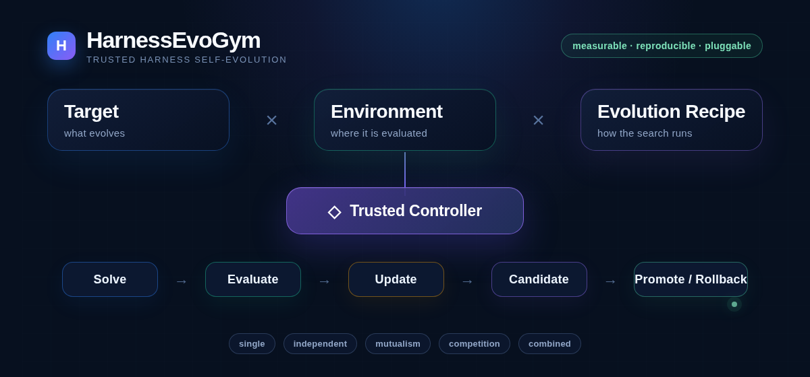

<p align="center">
  
</p>

<h1 align="center">HarnessEvoGym</h1>

<p align="center">
  <strong>面向 Agent Harness 的可复现 RSI 训练场</strong>
</p>

<p align="center">
  <a href="README.md">English</a> ·
  <a href="docs/architecture.zh.md">架构</a> ·
  <a href="CONTRIBUTING.md">贡献指南</a> ·
  <a href="README.dev.zh.md">开发日志</a>
</p>

<p align="center">
  
  
  
</p>

HarnessEvoGym 把“让 Agent 修改自己的 Harness，再验证修改是否真的有效”做成一个可审计的实验闭环。项目把被优化的 Harness、做题环境、进化算法、搜索策略和评测器分开，Controller 负责权限、隔离、晋升、回滚、断点和结果记录。

```text
Target Harness × Environment × Evolution Recipe
          ↓
   Solver 做题 → Verifier 评分 → Updater 修改 Candidate
          ↓
       Controller 决定保留、回退或暂停
```

当前稳定支持两类评测环境：**OmegaUse-OfficeVal** 和 **HLE Text-only Math**。前者验证 Agent 生成 Office 文件的能力，后者验证文本数学题的推理能力。两条链路使用不同的任务和沙箱，但共享 Candidate、Updater、反馈、晋升与审计原则。

## 项目能做什么

| 能力 | 当前实现 |
| --- | --- |
| 自适应进化 | Single、Independent、Mutualism、Competition、Combined 五种 Population Mode |
| 搜索策略 | Linear Hill Climb、Progressive Risk Expansion，以及受限的 Docker JSON Strategy API |
| Agent 更新器 | Codex CLI、DeepSeek Harness；Updater 在完整 Coding Agent Session 中读取反馈并修改 Candidate |
| Office 评测 | OmegaUse-OfficeVal 任务、独立 Solver 工作区、Office 文件产出、Verifier 容器打分 |
| HLE 评测 | `cais/hle` 的 text-only Math 子集、固定 validation/test split、模型 Judge、sealed test Broker |
| 可恢复运行 | 按题 Checkpoint、基础设施暂停、显式 Resume、冻结 Candidate 与运行身份校验 |
| 扩展接口 | Target、Environment、EvolutionAlgorithm、SearchStrategy、Updater 和 Evaluator 的 Adapter/SDK |

Harbor、SWE-bench 和 Synthetic Text Reasoning 目前保留为实验性接口或兼容代码，尚未列入本项目的稳定支持范围。

## 两个已支持的环境

### Office：OmegaUse-OfficeVal

Solver 在隔离的 Office 运行镜像中读取任务说明和原始输入，在临时工作区内使用 LibreOffice、Python 或 Bash 生成交付文件。Verifier 位于独立容器，使用只读交付物离线打分。原始数据集不会作为可写目录挂载，已经完成的题目可以在 Resume 时直接复用。

入口和说明：

- 环境 Adapter：`controller/src/environments/omegause-officeval.mjs`
- 运行说明：[`docs/cowork-mvp.zh.md`](docs/cowork-mvp.zh.md)
- 训练配置：`experiments/cowork-*.json`
- 独立泛化评测：[`eval/README.md`](eval/README.md)

### HLE：Text-only Math

HLE 链路固定 `cais/hle` revision，只保留没有图片的数学题，按 `raw_subject × answer_type` 做可复现抽样。validation 结果可以进入下一轮 Updater；test 题目、答案和 Judge 过程留在 sealed vault，不能参与晋升、回退或停止判断。

入口和说明：

- Campaign 配置：`benchmarks/hle-text-math/`
- Runtime 配置：`environments/hle-text-math/`
- HLE Solver/Judge：`controller/src/hle-partition-runner.mjs`
- HLE 数据准备：`scripts/download-hle-text-math.py`、`benchmarks/hle-text-math/prepare-split.mjs`
- 运行手册：[`benchmarks/hle-text-math/README.zh.md`](benchmarks/hle-text-math/README.zh.md)

HLE 数据受 Hugging Face 访问条件保护。数据、答案、API Key 和运行产物都不提交到 Git。

## 一轮进化怎么运行

```text
固定 Source 与 H0
    ↓
SearchStrategy 选择父 Candidate 和可变 Region
    ↓
Controller 发放 Mutation Lease
    ↓
Updater 读取反馈，在允许范围内修改 Candidate
    ↓
Controller 检查 Diff、资源和运行边界
    ↓
Solver 在 validation 题上做题
    ↓
Verifier 计算 Reward
    ↓
严格提升则晋升，否则回退；基础设施故障则暂停
```

Updater 可以分析失败原因、提出假设、修改代码并做自检；Controller 不替 Updater 编写固定的“修复规则”。Controller 只负责强制执行边界：Candidate 不能修改题目、Evaluator、凭据、隐藏测试、晋升规则或 Controller 本身。

## 路径和运行数据

仓库内的 Runtime JSON 只保存**相对配置文件的路径**，不绑定某一台机器的 `/mnt/...` 目录。加载时 Controller 会按 Runtime JSON 所在目录解析路径，再检查持久化根、临时根、数据集和工具链是否互不覆盖。

默认运行数据位于仓库旁边的 `../.rsi/`，可用环境变量或命令行参数改到其他位置：

```text
../.rsi/
├── runtime/       # HLE/Office 的持久化运行时、数据集和构建缓存
├── scratch/       # 题目工作区、Verifier 临时文件和日志
└── campaigns/     # 运行状态、Candidate、Checkpoint 和报告
```

配置文件、数据集和运行产物互相分离。任何密钥都通过运行时 FD 注入，不写入配置、日志、Trace 或 Candidate。

Codex/Claude Code 的宿主 CLI 安装目录也不写入仓库。运行前设置
`RSI_*_DISTRIBUTION_ROOT`、`RSI_NODE_BINARY`、`RSI_BWRAP_PATH` 和
`RSI_SETPRIV_PATH`；Controller 会在真正启动 Updater 前解析并核验这些路径、版本和 distribution 摘要。

## 快速开始

需要 Linux、Docker、Node.js 20+、npm 和 Git。

```bash
git clone https://github.com/autocosm-ai/HarnessEvoGym.git
cd HarnessEvoGym
npm ci
npm run check
npm test
npm run test:eval
```

先做离线配置校验：

```bash
npm run rsi -- experiment validate \
  --config experiments/reasoning-msa-progressive-strict-smoke.json
```

OfficeVal 的数据准备、Runtime 构建、训练和 Final 评测见 [`docs/cowork-mvp.zh.md`](docs/cowork-mvp.zh.md)。HLE 需要先准备门控数据，再按 [`benchmarks/hle-text-math/README.zh.md`](benchmarks/hle-text-math/README.zh.md) 启动 validation-only 校准和正式 Campaign。

## 如何扩展

- 新 Harness：实现 Target Adapter，声明 Source、H0、Runtime、Validator 和可变 Region。
- 新任务领域：实现 Environment Adapter，提供任务物化、隔离工作区、Verifier、指标和数据划分。
- 新搜索方法：实现 SearchStrategy，只返回受信 Catalog 中的 Region ID 和父 Candidate。
- 新进化方法：注册兼容现有 Population 状态、Branch、Budget、Checkpoint 和 Resume 契约的 EvolutionAlgorithm。
- 新更新器：实现 Updater Adapter，保留完整 Coding Agent Session，并让 Controller 管理可写权限。

外部插件当前需要由受信启动脚本显式注册。插件 SDK 不会自动安装任意包，`sandbox` 插件仍需要独立进程执行器。

详细接口、协议边界和 PR 检查项见 [`CONTRIBUTING.md`](CONTRIBUTING.md)。开发过程、验证记录和版本变更见单独的 [`README.dev.zh.md`](README.dev.zh.md)。

## 当前边界

- Office 的 Linux 运行链路不覆盖依赖 Windows COM 的题目。
- HLE 当前是 text-only Math 子集，不代表完整 HLE 成绩。
- Sealed test 只在正式 Final/关闭流程中解锁，不能用于进化决策。
- Harbor、SWE-bench 和其他新环境还需要独立的协议、隔离和端到端验证，暂不作为稳定环境承诺。
- 项目当前是研究预览版，正式比较需要预注册 Seed、Trial、资源预算和统计汇总。

## 许可证

Controller 与本仓库新增代码使用 MIT License。`sources/deepseek-harness/` 是固定版本的上游子模块，遵循其自身许可证和版权声明。
